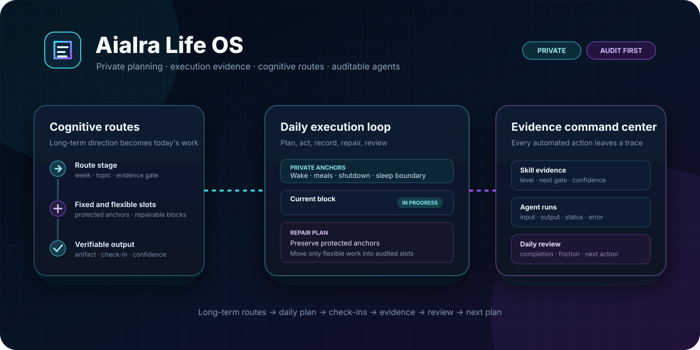
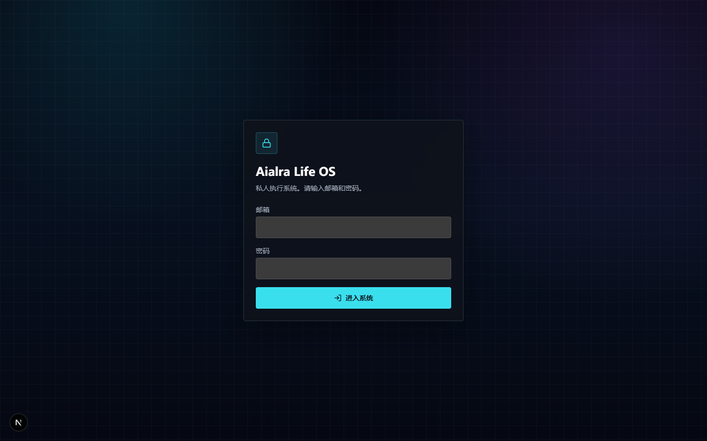
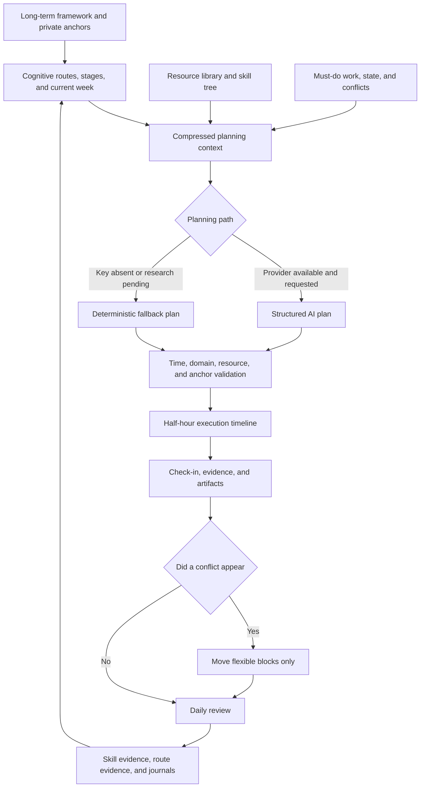
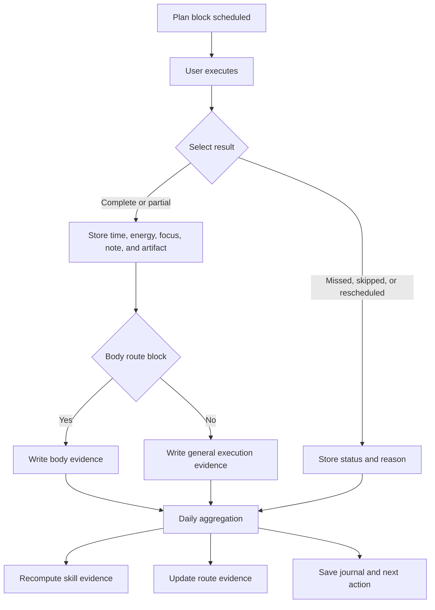

<div align="center">
  

# Aialra Life OS

**Compile long-term direction into private daily work that can be executed, checked in, and reviewed**

<sub>Single-user first · dark command center · protected anchors · fully auditable AI output</sub>


[简体中文](README.md) · [Current capabilities](#2-current-capabilities) · [Preview](#3-interface-preview) · [Local setup](#11-local-setup) · [Documentation](#14-documentation-map)
</div>

<div align="center">
  <sub>Figure 1.1 — Long-term routes feed a loop of daily execution, evidence capture, and review</sub>
</div>

## 1 Project Positioning

Aialra Life OS is a private, single-user-first knowledge and execution system [1].

It combines a long-term framework, cognitive routes, resources, skills, daily input, execution check-ins, and agent records in one auditable loop.

It is more than a calendar or chat interface. Direction becomes scheduled work, while artifacts and execution logs show what actually happened.

The public README excludes real deployment domains, login accounts, passwords, keys, personal routine values, and production server paths.

## 2 Current Capabilities

<div align="center">

Table 2.1 — Product capabilities implemented in the current code

| Domain | Current implementation | Visible entry point |
| --- | --- | --- |
| Login | Supabase sessions and a local single-user fallback | `/login` |
| Daily overview | Anchors, completion, domain progress, timeline, skills, and agent state | `/dashboard` |
| Daily planning | Daily input, structured AI generation, deterministic fallback, and JSON import | `/plan/new`, `/plan/today` |
| Execution logging | Complete, partial, missed, skipped, rescheduled, and body check-ins | Block check-in API and dialog |
| Cognitive routes | Routes, stages, weekly topics, fixed slots, course slots, and current-route view | `/routes`, `/routes/current` |
| Repair plan | Preserves fixed anchors and moves conflicting flexible work into audited slots | Current-route page and repair API |
| Resource library | List, details, filters, and manual creation | `/resources`, `/resources/[id]` |
| Skill evidence | Skill levels, evidence count, next gate, and confidence | `/skills` |
| Agent audit | Stores input, output, state, error, model, and timestamps | `/agents` |
| Daily review | Aggregates completion and writes review, skill, and route evidence | `/review/daily` |
| Settings | Environment status, seed import, and private life context | `/settings` |

</div>

The 2026-06-25 execution report records end-to-end evidence for the cognitive-route and body-route work [2].

This README iteration revalidated code, types, tests, build, schema, and the anonymous login page without production credentials or private data.

## 3 Interface Preview

<div align="center">
  

Figure 3.1 — The private login boundary in a real browser, with empty fields and no account information
</div>

The UI uses a dark knowledge-command-center style with a low-intensity grid, glass panels, cyan primary accents, and violet secondary accents.

Authenticated pages use left navigation, a command bar, a central execution area, and a right-side context panel.

## 4 Core Loop

<div align="center">



Figure 4.1 — A daily plan is an auditable cycle of validation, execution, repair, and evidence [1]

</div>

The deterministic fallback matters because the system must save an executable plan even when no AI key is configured or background research is still running.

## 5 Cognitive Route Engine

<div align="center">

Table 5.1 — Objects that compile long-term routes into a daily timeline

| Object | Stored information | Daily effect |
| --- | --- | --- |
| CognitiveRoute | Name, domain, period, and state | Defines long-term direction |
| RouteStage | Objective, duration, and completion standard | Limits work to the current growth stage |
| RouteWeek | Theme, concrete topics, resources, and expected evidence | Supplies executable daily content |
| FixedTimeSlotTemplate | Time, type, protection, and default rule | Preserves immutable anchors and fixed training |
| CourseSlot | Course time, location, and lock state | Adds external commitments to conflict detection |
| OpenAgentSlot | Date, slot, reason, and source | Accepts new conflicts and agent repairs |
| RouteEvidenceNode | Current level, next gate, artifact requirement, and confidence | Determines whether progress has evidence |
| CodexSidecarTask | Plan block, prompt, state, and output summary | Queues work for an external agent |

</div>

Current seeds include chip and EDA, AI systems, business, body, vocal, dance, and music routes.

Detailed route weeks, fixed slots, and private anchors are configuration. The public landing page explains their structure without exposing personal values.

## 6 Planning Paths

<div align="center">

Table 6.1 — Planning paths and failure boundaries

| Path | Trigger | Saved result | Failure boundary |
| --- | --- | --- | --- |
| Normal plan | AI provider configured and no deep research needed | Structured plan and AgentRun | Rejects direct persistence when validation fails |
| Deep research | Daily input explicitly requests resource research | Background research record and immediate fallback plan | Completion polling remains unimplemented |
| Deterministic fallback | Missing key, request failure, or pending research | Plan based on fixed slots and the current route week | Quality depends on current seeds and context |
| Manual prompt package | User delegates work to an external model | Audited prompt files and JSON import constraints | Imported output still passes local validation |
| Repair plan | New commitments conflict with scheduled blocks | OpenAgentSlot, edits, and AgentRun | Protected anchors never move |

</div>

Every AI result must be stored. A model response never exists only as untraceable transient text [3].

## 7 Execution and Evidence

<div align="center">



Figure 7.1 — Block outcomes feed execution, body, skill, route, and journal evidence [2]

</div>

Append-only AgentRun records preserve inputs, outputs, errors, and states so planning and repair decisions can be reviewed.

## 8 System Structure

<div align="center">

Table 8.1 — Technology layers and responsibilities

| Layer | Current technology | Responsibility |
| --- | --- | --- |
| Interface | Next.js App Router, React, Tailwind CSS, Radix primitives, Lucide | Pages, forms, timeline, and command-center layout |
| Session | Supabase SSR or local single-user fallback | Private access boundary |
| API | Next.js Route Handlers and Zod | Request validation and domain operations |
| Planning and review | OpenAI SDK and deterministic TypeScript | Generate, validate, repair, and review |
| Data access | Prisma Client | Type-safe access to relational data |
| Database | PostgreSQL | Plans, logs, resources, skills, routes, and audit records |
| Optional storage | Supabase Storage | Future private attachments and artifacts |
| Charts | Recharts dependency | Future trend and risk visualization |

</div>

`prisma/schema.prisma` is the authoritative source for domain models and enums spanning private configuration through body check-ins [4].

## 9 Data and APIs

<div align="center">

Table 9.1 — Main API groups

| Group | Representative endpoint | Responsibility |
| --- | --- | --- |
| Identity | `POST /api/auth/login` | Supabase or local single-user login |
| Seeds | `POST /api/seed/import` | Import framework, resources, skills, and prompts |
| Plans | `POST /api/plan/generate`, `GET /api/plan/today` | Generate and read the current plan |
| Check-ins | `POST /api/plan/block/[id]/checkin` | Save execution outcomes and body evidence |
| Repair | `POST /api/plan/repair` | Adjust flexible work and preserve an audit record |
| Routes | `GET /api/routes`, `GET /api/routes/current` | Return routes and current-week context |
| Courses and open slots | CourseSlot and OpenAgentSlot endpoints | Manage external commitments and new conflicts |
| Review | `POST /api/review/daily` | Save review and evidence updates |
| Resources and skills | Resource and Skill endpoints | Maintain resources and recompute skills |
| Agents | `GET /api/agents` and Sidecar endpoints | Query runs and queued work |

</div>

The API contract records minimum request and response shapes using fictional dates and placeholder identifiers [5].

## 10 Private Deployment Options

<div align="center">

Table 10.1 — Supported operating models

| Model | Data location | Identity | Suitable when |
| --- | --- | --- | --- |
| Self-hosted | Private PostgreSQL and server storage | Local fallback or Supabase | Data and services should remain under owner control |
| Managed combination | Supabase Postgres, Auth, and Storage with a compatible platform | Supabase Auth | Managed identity, storage, or external database is needed |

</div>

The current production note selects self-hosted Next.js, a reverse proxy, PostgreSQL, and process supervision, while Supabase and Vercel remain optional [6].

Real domains, proxy targets, service names, server paths, and TLS configuration belong only in the private runtime environment.

Public examples use the reserved `.invalid` namespace when a domain shape is needed.

## 11 Local Setup

You need Node.js, npm, and PostgreSQL. AI, Supabase identity, and managed storage are optional integrations.

1. Install locked dependencies and generate the Prisma client.

```bash
npm ci # Install versions recorded in package-lock.json
npm run db:generate # Generate the type-safe Prisma client
```

2. Create an untracked local environment file.

```bash
cp .env.example .env # Create a local-only configuration file
```

3. Fill private settings in `.env`. A database connection is the minimum requirement.

<div align="center">

Table 11.1 — Environment variables and public boundaries

| Variable | Required | Stored information | Public rule |
| --- | --- | --- | --- |
| `DATABASE_URL` | Yes | Application PostgreSQL connection | Secret management or untracked environment only |
| `DIRECT_URL` | For migrations | Direct database connection | Never place in README, logs, or commits |
| `NEXT_PUBLIC_SUPABASE_URL` | Supabase mode | Public Supabase project endpoint | Use only the value for the current environment |
| `NEXT_PUBLIC_SUPABASE_ANON_KEY` | Supabase mode | Browser anonymous public key | Still requires correct row-level security |
| `SUPABASE_SERVICE_ROLE_KEY` | Server features | Privileged service key | Never send to a browser |
| `OPENAI_API_KEY` | Optional AI path | AI provider credential | Server-side access only |
| `NEXT_PUBLIC_APP_URL` | Deployment | Current environment entry point | Real production value stays out of public docs |
| `LIFEOS_E2E_ENV_FILE` | Optional deep E2E | Additional secret environment-file path | Path and contents remain private |

</div>

4. Prepare the model, seeds, and local web application.

```bash
npm run db:push # Synchronize the current Prisma model to a development database
npm run seed:import # Import framework, resources, skills, and prompts
npm run seed:routes # Import cognitive routes, stages, weeks, and fixed slots
npm run seed:body-routes # Import body routes and evidence nodes
npm run dev # Start the local development web application
```

When migration history is required, use `npm run db:migrate -- --name <migration-name>`. The name should identify the model change.

## 12 Verification Results

<div align="center">

Table 12.1 — Checks executed against the current default branch on 2026-08-24

| Check | Result | Evidence scope |
| --- | --- | --- |
| Dependency install | Passed | `npm ci` installed and audited 663 locked dependencies |
| Prisma Client | Passed | Client 6.19.3 generated successfully |
| ESLint | Passed | Repository passed with a zero-warning threshold |
| TypeScript | Passed | No type errors after Prisma Client generation |
| Vitest | Passed | 7 test files and 17 tests passed |
| Next.js build | Passed | Next.js 16.2.7 compiled every page and endpoint |
| Prisma schema | Passed | `prisma/schema.prisma` validated |
| Real browser | Passed | Login rendered at desktop size with 0 console errors and 0 warnings |
| Dependency audit | Action required | npm reports 9 high and 1 low findings; no disruptive automated upgrade was applied |

</div>

The Vitest repository alias now uses a cross-platform file URL conversion, so all tests import and run on Windows.

This validation did not connect to the production database, log into a real account, or rerun production flows that require private credentials.

The historical report records 17 unit tests, API E2E, browser E2E, and load tests as passing at that time [2].

```bash
npm run lint # Run the zero-warning ESLint gate
npm run typecheck # Run TypeScript type checking
npm run test # Run Vitest unit tests
npm run build # Generate Prisma Client and build Next.js
npx prisma validate # Validate the Prisma schema
npm audit # Inspect current dependency findings and remediation scope
```

## 13 Security Boundaries

<div align="center">

Table 13.1 — Public-repository boundaries for a private system

| Object | Current rule | Boundary failure |
| --- | --- | --- |
| Production domain and infrastructure | Current branch uses `.invalid` placeholders or prose | Real entry points must not appear in README or source defaults |
| Login email and password | Read only from private environment | Local login is unavailable when configuration is missing |
| Service keys | Server-side access only | A privileged key reaching a browser is a security incident |
| AI input and output | Preserve AgentRun for audit | Remove secrets and unrelated private data before storage |
| Personal routine and body records | Private database and configuration | README, screenshots, and examples omit real values |
| Resource and artifact links | Record access channel and evidence purpose | Private links cannot become public examples |
| File upload | Real upload UI is not implemented | A recorded URL must not be described as completed private storage |
| Dependency findings | High-severity findings remain | Production upgrade needs explicit remediation and regression tests |

</div>

The deep E2E script no longer contains fixed server secret-file paths. An additional environment file must be explicitly supplied through `LIFEOS_E2E_ENV_FILE` in the private runtime.

## 14 Documentation Map

<div align="center">

Table 14.1 — Repository sources of truth

| File | Contents |
| --- | --- |
| [`AGENTS.md`](AGENTS.md) | Mission, hard constraints, stack, and quality gates |
| [`docs/PROJECT_BUILD_PLAN_FULL.md`](docs/PROJECT_BUILD_PLAN_FULL.md) | Complete build route, modules, sequence, and acceptance |
| [`docs/README_INITIAL_BUILD.md`](docs/README_INITIAL_BUILD.md) | First-version scope, pages, and user flows |
| [`docs/API_CONTRACT.md`](docs/API_CONTRACT.md) | Minimum plan, check-in, and review contracts |
| [`docs/AGENT_SPEC.md`](docs/AGENT_SPEC.md) | Planner, Research, Review, SkillTree, and Resource Agent behavior |
| [`docs/UI_SPEC.md`](docs/UI_SPEC.md) | Dark command-center layout, color, and components [7] |
| [`docs/ACCESS_STRATEGY.md`](docs/ACCESS_STRATEGY.md) | Public resources, commercial tools, and purchase rules [8] |
| [`docs/MVP_90_DAY_ROADMAP.md`](docs/MVP_90_DAY_ROADMAP.md) | Phased route from skeleton to hardened deployment [9] |
| [`docs/CURRENT_PRODUCTION.zh.md`](docs/CURRENT_PRODUCTION.zh.md) | Redacted current deployment choice |
| [`docs/reports/cognitive-route-engine-v1-report.md`](docs/reports/cognitive-route-engine-v1-report.md) | Historical cognitive-route and body-route evidence |
| [`prisma/schema.prisma`](prisma/schema.prisma) | Authoritative relational model and enums |
| [`seed/`](seed) | Framework, resources, skills, routes, and output schemas |

</div>

## 15 Roadmap

<div align="center">

Table 15.1 — Follow-up work recorded by the code and documentation

| Priority | Work | Completion evidence |
| ---: | --- | --- |
| 1 | Remediate high-severity dependency findings and lock compatible versions | Audit has no unaccepted high findings and all gates pass |
| 2 | Poll or receive webhook results from background deep research | Completed research writes ResearchReport and AgentRun automatically |
| 3 | Add editable AI plan revision history | Every edit is comparable, reversible, and auditable |
| 4 | Build a private Supabase Storage upload UI | Object privacy, access policy, and short-lived links are tested |
| 5 | Add vector-backed resource retrieval | Results trace to source resources and chunks |
| 6 | Complete trend, risk, and rescue-plan charts | Completion, sleep, movement, focus, and risk have reviewable sources |
| 7 | Add restore drills and a production operations manual | Encrypted backup restores to a login-ready state with measured timing |

</div>

## 16 Known Limitations

- Sidecar Task currently queues and audits work but does not automatically invoke Codex to execute external commands.

- A fallback plan is saved while deep research runs, but automatic completion polling or webhook handling is not implemented.

- File capability mainly records artifact URLs; the Supabase Storage upload interface is not implemented.

- Route weeks derive from seed start dates, and no UI currently adjusts route start dates.

- Recharts is installed, but the complete trend dashboard remains roadmap work.

- The repository has no continuous-integration workflow, so a local or external process must explicitly run quality gates.

- Production database E2E requires private credentials and was not rerun during this public README iteration.

## 17 Contribution Workflow

1. Read `AGENTS.md` and the design, API, schema, or execution report related to the change.

2. Confirm that the change preserves private anchors, required domains, AI audit, and seed import.

3. Implement one minimal verifiable outcome without committing accounts, domains, server paths, or secrets.

4. Generate Prisma Client, then run lint, types, tests, build, and schema validation.

5. Use a real browser for visible work and check success, failure, and console behavior.

6. Record the validation scope, omitted checks, and known limitations in the commit or execution report.

## 18 License Status

This repository has no license file. Public visibility does not grant permission to copy, modify, or redistribute the work.

Obtain authorization until the maintainers add an explicit license.

## 19 References

[1] AIALRA-0, “Aialra Life OS v0.1 Full Initial Project Build Package,” `docs/PROJECT_BUILD_PLAN_FULL.md`, 2026.

[2] AIALRA-0, “LifeOS Cognitive Route Engine v1 + Body Routes Patch v1 Execution Report,” `docs/reports/cognitive-route-engine-v1-report.md`, 2026.

[3] AIALRA-0, “Agent Spec,” `docs/AGENT_SPEC.md`, 2026.

[4] AIALRA-0, “Aialra Life OS Prisma Schema,” `prisma/schema.prisma`, 2026.

[5] AIALRA-0, “API Contract,” `docs/API_CONTRACT.md`, 2026.

[6] AIALRA-0, “Current Production Deployment Note,” `docs/CURRENT_PRODUCTION.zh.md`, 2026.

[7] AIALRA-0, “UI Spec: DeepWiki-like Aialra Life OS,” `docs/UI_SPEC.md`, 2026.

[8] AIALRA-0, “Industry Resource Access Strategy,” `docs/ACCESS_STRATEGY.md`, 2026.

[9] AIALRA-0, “90-Day Roadmap,” `docs/MVP_90_DAY_ROADMAP.md`, 2026.
