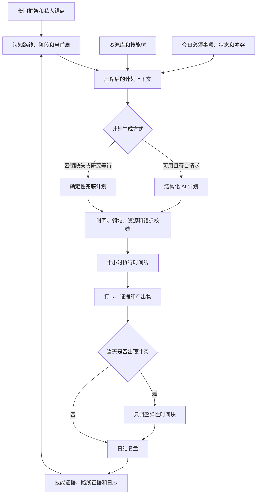
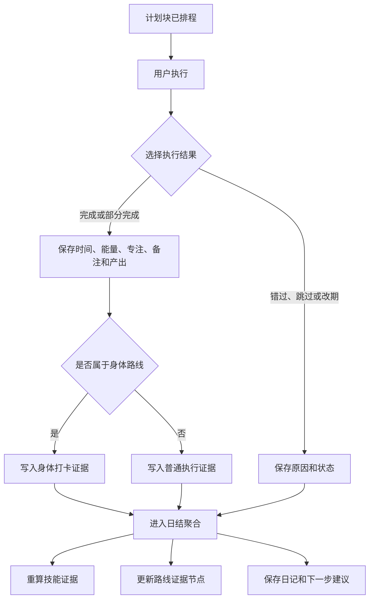

<div align="center">
  

# Aialra Life OS

**把长期方向编译成今天能执行、能打卡、能复盘的私人行动系统**

<sub>单用户优先 · 深色命令中心 · 固定锚点保护 · AI 输出全程可审计</sub>


[English](README.en.md) · [当前能力](#2-当前能力) · [界面预览](#3-界面预览) · [本地运行](#11-本地运行) · [文档导航](#14-文档导航)
</div>

<div align="center">
  <sub>图 1.1　长期路线经过每日执行、证据记录和复盘后进入下一次计划循环</sub>
</div>

## 1 项目定位

Aialra Life OS 是一套单用户优先的私人知识行动系统 [1]

系统把长期框架、认知路线、资源库、技能树、每日输入、执行打卡和 Agent 记录放进同一个可审计闭环

它不只是日历，也不只是聊天界面，系统需要把方向变成时间块，再用产出物和执行记录证明当天实际发生了什么

公开 README 不展示真实部署域名、登录账户、密码、密钥、个人作息值或生产服务器路径

## 2 当前能力

<div align="center">

表 2.1　当前代码已经实现的产品能力

| 能力域 | 当前实现 | 可见入口 |
| --- | --- | --- |
| 登录 | Supabase 会话和本地单用户兜底 | `/login` |
| 今日总览 | 锚点、完成率、领域进度、时间线、技能摘要和 Agent 状态 | `/dashboard` |
| 每日计划 | 今日输入、结构化 AI 生成、确定性兜底和 JSON 导入 | `/plan/new`、`/plan/today` |
| 执行记录 | 完成、部分、错过、跳过、改期和身体打卡 | 计划块打卡接口和弹窗 |
| 认知路线 | 路线、阶段、周主题、固定槽、课程槽和当前路线视图 | `/routes`、`/routes/current` |
| 修复计划 | 保护固定锚点，把冲突的弹性工作转入可审计空槽 | 今日路线页和修复接口 |
| 资源库 | 资源列表、详情、筛选和手动新增 | `/resources`、`/resources/[id]` |
| 技能证据 | 技能层级、证据数量、下一道门槛和置信度 | `/skills` |
| Agent 审计 | 保存输入、输出、状态、错误、模型和时间 | `/agents` |
| 日结复盘 | 聚合完成度并写入复盘、技能证据和路线证据 | `/review/daily` |
| 系统设置 | 环境状态、种子导入和私人生活上下文 | `/settings` |

</div>

2026-06-25 的执行报告记录了认知路线引擎和身体路线补丁的端到端结果 [2]

本次 README 迭代重新验证了代码、类型、测试、构建、模型和匿名登录页，没有使用生产凭据或访问私人数据

## 3 界面预览

<div align="center">
  

图 3.1　真实浏览器中的私人登录边界，输入框为空且未显示任何账户信息
</div>

界面采用深色知识命令中心风格，使用低亮度网格、玻璃面板、青色主强调和紫色辅助强调

登录后的应用结构由左侧导航、顶部命令栏、中央执行区和右侧上下文区组成

## 4 核心闭环

<div align="center">



图 4.1　每日计划不是一次性 AI 输出，校验、执行、修复和证据回写共同形成闭环 [1]

</div>

确定性兜底很重要，即使没有 AI 密钥或后台研究仍在运行，系统也需要先保存一份可以开始执行的合规计划

## 5 认知路线引擎

<div align="center">

表 5.1　长期路线进入当天时间线时使用的对象

| 对象 | 保存内容 | 对当天计划的影响 |
| --- | --- | --- |
| CognitiveRoute | 路线名称、领域、周期和状态 | 定义长期方向 |
| RouteStage | 阶段目标、周数和完成标准 | 限定当前成长阶段 |
| RouteWeek | 周主题、具体主题、资源和预期证据 | 提供当天可执行内容 |
| FixedTimeSlotTemplate | 固定时间、类型、保护状态和默认规则 | 保留不可移动锚点和固定训练 |
| CourseSlot | 课程时间、位置和锁定状态 | 把外部课程纳入冲突判断 |
| OpenAgentSlot | 日期、空槽、原因和来源 | 承接当天新冲突和 Agent 修复 |
| RouteEvidenceNode | 当前等级、下一道门槛、产出要求和置信度 | 决定路线是否具备推进证据 |
| CodexSidecarTask | 计划块、提示、状态和产出摘要 | 保存需要外部 Agent 继续处理的工作 |

</div>

当前种子包含芯片和电子设计自动化、AI 系统、商业、身体、声乐、舞蹈和音乐路线

详细路线周、固定槽和私人锚点属于系统配置，公开首页只说明结构，不展示个人实际值

## 6 计划生成机制

<div align="center">

表 6.1　计划生成路径和失败边界

| 路径 | 触发条件 | 保存结果 | 失败边界 |
| --- | --- | --- | --- |
| 普通计划 | AI 提供方已配置且不需要深度研究 | 结构化计划和 AgentRun | 校验失败时拒绝直接入库 |
| 深度研究 | 今日输入明确要求资源研究 | 后台研究记录和立即可用兜底计划 | 研究完成后的轮询仍未实现 |
| 确定性兜底 | AI 密钥缺失、请求失败或研究等待 | 基于固定槽和当前路线周的计划 | 内容质量受种子和当前上下文限制 |
| 手动提示包 | 用户希望在外部模型中处理 | 可审计提示文件和 JSON 导入约束 | 导入结果仍需本地校验 |
| 修复计划 | 临时事项和现有时间块冲突 | OpenAgentSlot、调整结果和 AgentRun | 受保护锚点保持不动 |

</div>

所有 AI 输出都必须保存，系统不会把模型回复当作无法追溯的临时文本 [3]

## 7 证据链

<div align="center">



图 7.1　计划块的结果会进入执行日志、身体证据、技能证据或路线证据 [2]

</div>

追加式 Agent 运行记录保存输入、输出、错误和状态，便于复核模型为何生成某个计划或修复建议

## 8 系统结构

<div align="center">

表 8.1　主要技术层和责任

| 层 | 当前技术 | 责任 |
| --- | --- | --- |
| 用户界面 | Next.js App Router、React、Tailwind CSS、Radix primitives、Lucide | 页面、表单、时间线和命令中心布局 |
| 会话 | Supabase SSR 或本地单用户兜底 | 建立私人访问边界 |
| 接口 | Next.js Route Handlers、Zod | 校验请求并执行领域操作 |
| 计划和复盘 | OpenAI SDK、确定性 TypeScript 逻辑 | 生成、校验、修复和复盘 |
| 数据访问 | Prisma Client | 访问 PostgreSQL 关系模型 |
| 数据库 | PostgreSQL | 保存计划、日志、资源、技能、路线和审计记录 |
| 可选存储 | Supabase Storage | 后续保存私人附件和产出物 |
| 图表 | Recharts 依赖 | 后续趋势和风险可视化 |

</div>

`prisma/schema.prisma` 保存从私人配置到身体打卡的领域模型和枚举，是当前数据结构的权威来源 [4]

## 9 接口总览

<div align="center">

表 9.1　主要接口分组

| 分组 | 代表接口 | 当前责任 |
| --- | --- | --- |
| 身份 | `POST /api/auth/login` | Supabase 或本地单用户登录 |
| 种子 | `POST /api/seed/import` | 导入框架、资源、技能和提示模板 |
| 计划 | `POST /api/plan/generate`、`GET /api/plan/today` | 生成和读取当天计划 |
| 打卡 | `POST /api/plan/block/[id]/checkin` | 保存执行结果和身体证据 |
| 修复 | `POST /api/plan/repair` | 调整弹性块并保留审计记录 |
| 路线 | `GET /api/routes`、`GET /api/routes/current` | 返回路线和当前周上下文 |
| 课程和空槽 | CourseSlot、OpenAgentSlot 接口 | 管理外部课程和临时冲突 |
| 复盘 | `POST /api/review/daily` | 保存日结和证据更新 |
| 资源和技能 | Resource、Skill 接口 | 维护资源并重算技能 |
| Agent | `GET /api/agents`、Sidecar 接口 | 查询运行记录和排队任务 |

</div>

请求和响应的最小形状记录在 API 契约中，示例使用虚构日期和占位标识 [5]

## 10 私有部署选择

<div align="center">

表 10.1　当前支持的两类运行方式

| 方式 | 数据位置 | 身份方式 | 适用情况 |
| --- | --- | --- | --- |
| 自托管 | 私有 PostgreSQL 和服务器文件系统 | 本地单用户兜底或 Supabase | 希望数据和服务由自己控制 |
| 托管组合 | Supabase Postgres、Auth、Storage 加兼容平台 | Supabase Auth | 需要托管身份、存储或外部数据库 |

</div>

当前生产说明选择自托管 Next.js、反向代理、PostgreSQL 和进程守护，Supabase 和 Vercel 保持可选 [6]

真实域名、反向代理目标、服务名称、服务器路径和 TLS 配置只属于私有运行环境

公开示例需要域名时使用保留的 `.invalid` 命名空间

## 11 本地运行

需要 Node.js、npm 和 PostgreSQL，AI、Supabase 身份和托管存储属于可选集成

- 第一步，按锁文件安装依赖

```bash
npm ci # 安装 package-lock.json 固定的依赖版本
npm run db:generate # 根据 Prisma 模型生成类型安全客户端
```

- 第二步，从示例文件创建未跟踪的本地环境文件

```bash
cp .env.example .env # 创建只在本机使用的配置文件
```

- 第三步，在 `.env` 中填写私人配置，至少提供数据库连接

<div align="center">

表 11.1　环境变量和公开边界

| 变量 | 是否必需 | 保存内容 | 公开规则 |
| --- | --- | --- | --- |
| `DATABASE_URL` | 是 | 应用使用的 PostgreSQL 连接 | 只放在秘密管理或未跟踪环境文件 |
| `DIRECT_URL` | 迁移时需要 | 直接数据库连接 | 不写入 README、日志或提交 |
| `NEXT_PUBLIC_SUPABASE_URL` | Supabase 模式需要 | Supabase 项目公开入口 | 只使用当前环境对应值 |
| `NEXT_PUBLIC_SUPABASE_ANON_KEY` | Supabase 模式需要 | 浏览器匿名公钥 | 仍需配合数据库行级安全策略 |
| `SUPABASE_SERVICE_ROLE_KEY` | 服务端功能需要 | 高权限服务密钥 | 绝不发送到浏览器 |
| `OPENAI_API_KEY` | AI 路径可选 | AI 提供方凭据 | 只在服务端读取 |
| `NEXT_PUBLIC_APP_URL` | 部署时需要 | 当前环境入口 | 真实生产值不进入公开文档 |
| `LIFEOS_E2E_ENV_FILE` | 深度端到端测试可选 | 额外秘密环境文件路径 | 路径和内容都保存在私有运行环境 |

</div>

- 第四步，准备模型、种子和本地网页

```bash
npm run db:push # 把当前 Prisma 模型同步到开发数据库
npm run seed:import # 导入框架、资源、技能和提示模板
npm run seed:routes # 导入认知路线、阶段、周和固定槽
npm run seed:body-routes # 导入身体路线和对应证据节点
npm run dev # 启动本地开发网页
```

需要可追溯迁移历史时，使用 `npm run db:migrate -- --name <migration-name>`，迁移名称必须描述本次模型变化

## 12 验证结果

<div align="center">

表 12.1　2026-08-24 对当前默认分支执行的验证

| 检查 | 结果 | 证据范围 |
| --- | --- | --- |
| 依赖安装 | 通过 | `npm ci` 安装并审计锁文件中的 663 个依赖 |
| Prisma Client | 通过 | 6.19.3 客户端成功生成 |
| ESLint | 通过 | 全仓库 0 警告门槛通过 |
| TypeScript | 通过 | 生成 Prisma Client 后无类型错误 |
| Vitest | 通过 | 7 个测试文件、17 项测试通过 |
| Next.js 构建 | 通过 | Next.js 16.2.7 编译所有页面和接口 |
| Prisma 模型 | 通过 | `prisma/schema.prisma` 验证成功 |
| 真实浏览器 | 通过 | 登录页完成桌面视口渲染，控制台 0 错误、0 警告 |
| 依赖安全审计 | 需要处理 | npm 报告 9 个高风险和 1 个低风险依赖项，未执行破坏性自动升级 |

</div>

Vitest 的仓库根别名已经改用跨平台文件 URL 转换，Windows 现在可以导入并运行全部测试文件

本次验证没有连接生产数据库，没有登录真实账户，也没有重新执行需要私人凭据的生产端到端流程

历史报告记录了 17 项单元测试、API 端到端流程、浏览器流程和压力测试，当时所有检查通过 [2]

```bash
npm run lint # 执行零警告 ESLint 检查
npm run typecheck # 执行 TypeScript 类型检查
npm run test # 运行 Vitest 单元测试
npm run build # 生成 Prisma Client 并构建 Next.js 应用
npx prisma validate # 验证 Prisma 模型
npm audit # 查看当前依赖漏洞和修复范围
```

## 13 安全边界

<div align="center">

表 13.1　私人系统的公开仓库边界

| 对象 | 当前规则 | 越界结果 |
| --- | --- | --- |
| 生产域名和基础设施 | 当前分支只使用 `.invalid` 占位或文字说明 | 真实部署入口不得写入 README 和源文件默认值 |
| 登录邮箱和密码 | 只从私有环境读取 | 缺少配置时本地登录不可用 |
| 服务密钥 | 只在服务端读取 | 高权限密钥进入浏览器即视为安全事件 |
| AI 输入和输出 | 保存 AgentRun 并允许审计 | 保存前需要避免携带秘密和无关私人数据 |
| 个人作息和身体记录 | 属于私人数据库和配置 | README、截图和示例不展示真实值 |
| 资源和产出物链接 | 记录访问渠道和证据用途 | 私有链接不能当作公开示例 |
| 文件上传 | 当前真实上传界面尚未实现 | 不能把记录 URL 误称为已完成私有存储 |
| 依赖漏洞 | 当前审计仍有高风险项 | 生产升级前需要单独修复和回归验证 |

</div>

深度端到端脚本不再包含固定服务器秘密文件路径，额外环境文件必须由 `LIFEOS_E2E_ENV_FILE` 在私有运行环境中显式提供

## 14 文档导航

<div align="center">

表 14.1　项目事实来源

| 文件 | 内容 |
| --- | --- |
| [`AGENTS.md`](AGENTS.md) | 产品使命、硬约束、技术栈和质量门 |
| [`docs/PROJECT_BUILD_PLAN_FULL.md`](docs/PROJECT_BUILD_PLAN_FULL.md) | 全量构建路线、模块、顺序和验收 |
| [`docs/README_INITIAL_BUILD.md`](docs/README_INITIAL_BUILD.md) | 第一版范围、页面和核心用户流 |
| [`docs/API_CONTRACT.md`](docs/API_CONTRACT.md) | 计划、打卡和复盘接口的最小契约 |
| [`docs/AGENT_SPEC.md`](docs/AGENT_SPEC.md) | Planner、Research、Review、SkillTree 和 Resource Agent 规范 |
| [`docs/UI_SPEC.md`](docs/UI_SPEC.md) | 深色命令中心的布局、颜色和组件 [7] |
| [`docs/ACCESS_STRATEGY.md`](docs/ACCESS_STRATEGY.md) | 公开资源、商业工具和购买判断规则 [8] |
| [`docs/MVP_90_DAY_ROADMAP.md`](docs/MVP_90_DAY_ROADMAP.md) | 从工程骨架到加固部署的阶段路线 [9] |
| [`docs/CURRENT_PRODUCTION.zh.md`](docs/CURRENT_PRODUCTION.zh.md) | 脱敏后的当前部署选择说明 |
| [`docs/reports/cognitive-route-engine-v1-report.md`](docs/reports/cognitive-route-engine-v1-report.md) | 认知路线和身体路线的历史验证报告 |
| [`prisma/schema.prisma`](prisma/schema.prisma) | 当前关系模型和枚举的权威来源 |
| [`seed/`](seed) | 框架、资源、技能、路线和输出结构种子 |

</div>

## 15 迭代计划

<div align="center">

表 15.1　当前代码和文档共同记录的后续工作

| 优先级 | 工作 | 完成证据 |
| ---: | --- | --- |
| 1 | 修复 npm 审计中的高风险依赖并锁定兼容版本 | 安全审计无未接受高风险项，全部质量门通过 |
| 2 | 完成后台深度研究结果的轮询或 Webhook | 研究完成后自动写回 ResearchReport 和 AgentRun |
| 3 | 增加可编辑的 AI 计划修订历史 | 每次修改可比较、可回滚、可审计 |
| 4 | 实现 Supabase Storage 私有上传界面 | 私有对象、权限策略和短期访问经过测试 |
| 5 | 增加基于向量的资源检索 | 召回结果能够追溯到资源和片段 |
| 6 | 完成趋势、风险和救援计划图表 | 完成率、睡眠、运动、专注和风险有可复核数据源 |
| 7 | 增加备份恢复演练和生产操作手册 | 从加密备份恢复到可登录状态并记录时间 |

</div>

## 16 已知限制

- 当前 Sidecar Task 只负责排队和审计，不会自动调用 Codex 执行外部命令

- 深度研究开始后会保存兜底计划，后台结果的自动轮询或 Webhook 尚未实现

- 当前文件能力主要记录产出物 URL，Supabase Storage 上传界面尚未实现

- 路线周根据种子起始日期计算，尚未提供调整起始日期的用户界面

- Recharts 已列为依赖，但完整趋势仪表盘仍在路线图中

- 当前仓库没有持续集成工作流，质量门需要本地或外部流程显式执行

- 生产数据库端到端流程需要私人凭据，本次公开 README 迭代没有重跑

## 17 贡献流程

- 第一步，阅读 `AGENTS.md` 和与改动相关的设计、接口、数据模型或执行报告

- 第二步，确认改动不会破坏私人锚点、必需领域、AI 审计和种子导入

- 第三步，用最小可验证改动实现一个结果，不把账户、域名、服务器路径或密钥写入仓库

- 第四步，先生成 Prisma Client，再运行代码规范、类型、测试、构建和模型验证

- 第五步，涉及用户页面时使用真实浏览器检查成功路径、失败路径和控制台

- 第六步，把验证范围、未执行项目和已知限制写入提交说明或执行报告

## 18 许可状态

当前仓库没有许可证文件，公开可见不等于已经授予复制、修改或再分发权利

在维护者添加明确许可证前，使用本仓库内容需要先取得授权

## 19 参考资料

[1] AIALRA-0, “Aialra Life OS v0.1 全量初始项目构建包,” `docs/PROJECT_BUILD_PLAN_FULL.md`, 2026

[2] AIALRA-0, “LifeOS Cognitive Route Engine v1 + Body Routes Patch v1 执行报告,” `docs/reports/cognitive-route-engine-v1-report.md`, 2026

[3] AIALRA-0, “Agent Spec,” `docs/AGENT_SPEC.md`, 2026

[4] AIALRA-0, “Aialra Life OS Prisma Schema,” `prisma/schema.prisma`, 2026

[5] AIALRA-0, “API Contract,” `docs/API_CONTRACT.md`, 2026

[6] AIALRA-0, “当前生产部署说明,” `docs/CURRENT_PRODUCTION.zh.md`, 2026

[7] AIALRA-0, “UI Spec: DeepWiki-like Aialra Life OS,” `docs/UI_SPEC.md`, 2026

[8] AIALRA-0, “Industry Resource Access Strategy,” `docs/ACCESS_STRATEGY.md`, 2026

[9] AIALRA-0, “90-Day Roadmap,” `docs/MVP_90_DAY_ROADMAP.md`, 2026
